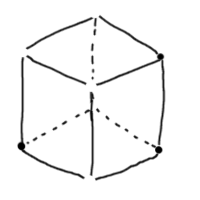
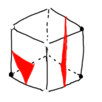

# Bevy Marching Cubes

see [this](http://paulbourke.net/geometry/polygonise/) for reference.
the goal is to make terraforming easier by implementing a 3D Contouring algorithm, as opposed to height maps.

the algorithm should compare 8 points in a cube to determine which are ground and which are air points. airpoints should
be above surface, whereas ground points should be below surface.

polygons are then drawn between air and ground lines, since between air and ground is surface.

The end result is visualized in Bevy.
